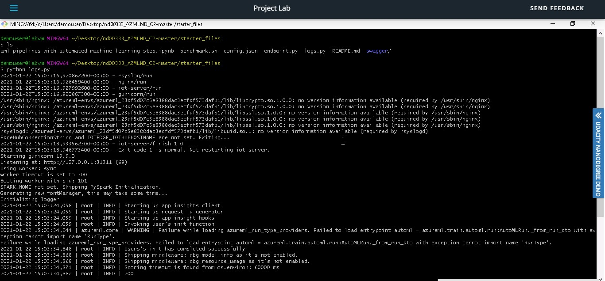
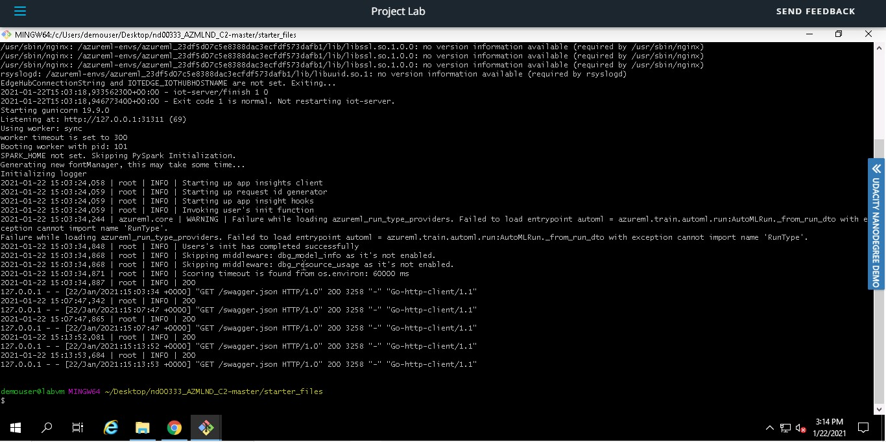
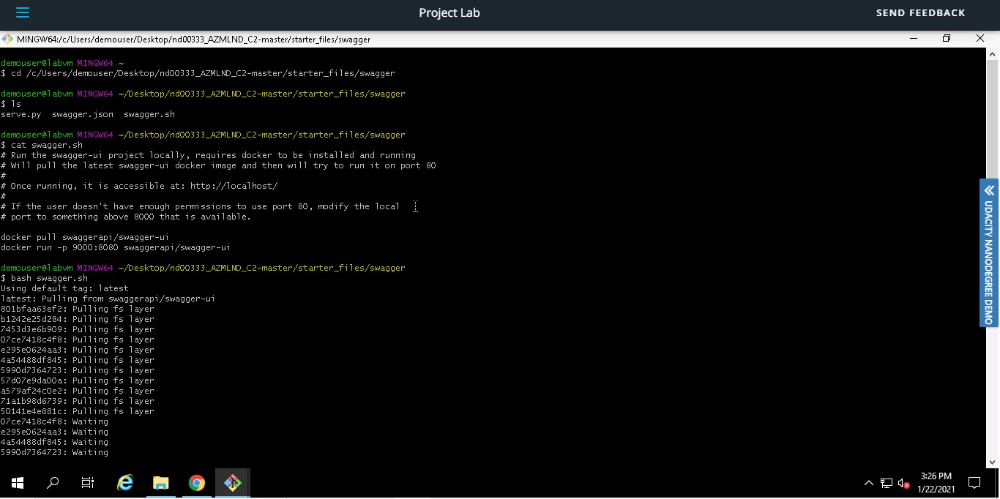
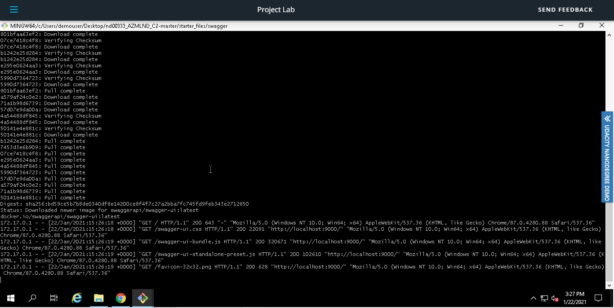
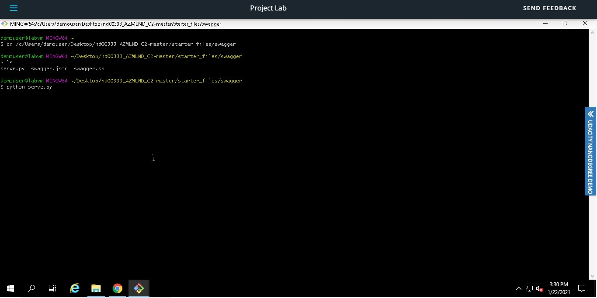
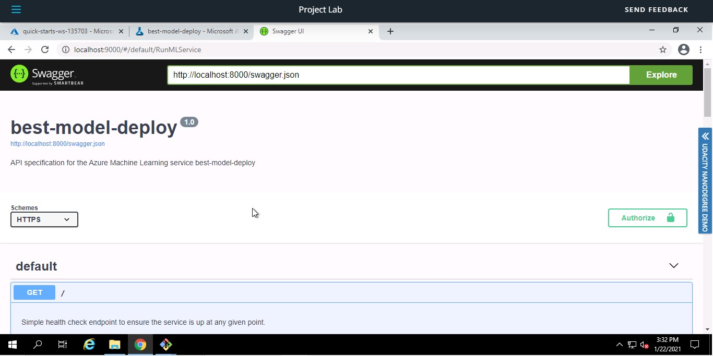
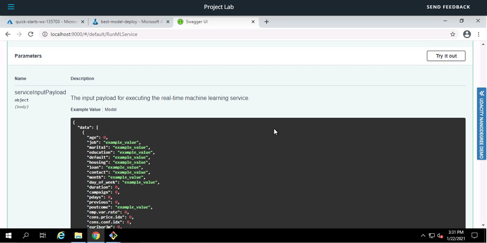
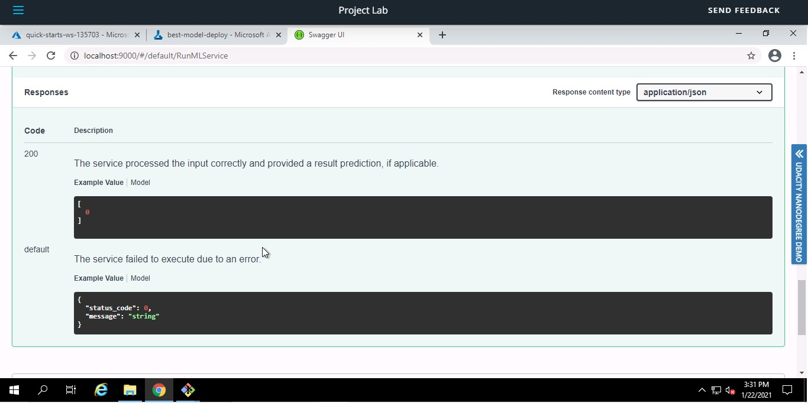
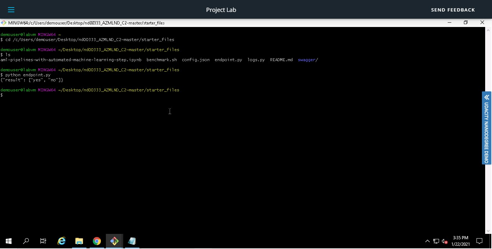
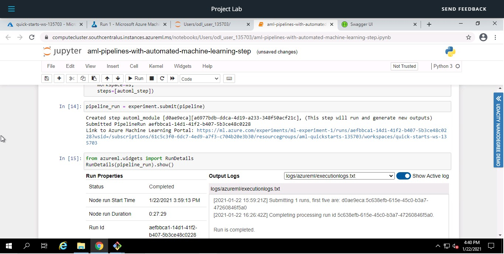

# Operationalizing Machine Learning

In this project Automated ML is used to find the best model. The model is then deployed. The application insigts are enabled in order to obtain importat information.In the later stages, a pipeline is also created and it is published. The dataset used for this project is Bank Marketing dataset. These are the steps that are followed to complete the project.

1.Authentication

2.Automated ML Experiment

3.Deploy the best model

4.Enable logging

5.Swagger Documentation

6.Consume model endpoints

7.Create and publish a pipeline

## Architectural Diagram

## Key Steps

1. Authentication

A service principal should be created for authetication. Since I did the project on the Lab provided with the course, it is done.

2.Auto ML Experiment

The Bank Marketing Dataset needs to be uploaded and a compute cluster  Standard_DS12_V2 is configured with 1 as the minimum umber of nodes. Then an Auto ML experiment is created to find the best model. The follwing screeshots shows the step.

### Dataset

### Autom ML Experiment Completed

### Auto ML Models

### Best Model

3. Deploy the best model
The best model, in this case, Voting Ensemble is deployed using Azure Container Instance(ACI) and we make sure that the deployment status is healthy.

### Deploying the best model

### Deployed Status- Healthy

4. Enable Logging 
Once the best model is deployed, we have to enable logging using the python file logs.py. The application insights are made true for the deployed endpoints and to retrieve the log. The following screenshots shows the logs.

### Running logs.py script

### Applications inisghts enabled to True

5.Swagger Documentation 
In this step, swagger container is deployed in order to view the swagger documetation. For this the swagger.json file is downloaded. The swagger.sh and serve.py file is run. All these files should be in the same folder. The GET and POST request could be observed in the swagger UI. The below screenshots show the swagger documentation.

### Running swagger.sh file

### Running serve.py file

### Swagger documentation

### GET request

### POST request

6. Consume Model Endpoints
Since the model is deployed, we can interact with the trained model. The endpoint.py file is used to show that the endpoint is consumed. The below screenshot shows the response that endpoint.py returns.

### Running endpoints.py file

7. Create and Publish a Pipeline
In this step a pipeline is created. Jupyter notebook is used for AutoML run. config.json file is downloaded. After setting the pipeline, the pipeline is run and late it is published which could be observed under pipline endpoints. The follwoing screenshots shows the creation and publishing of the pipleine.

### Pipeline created

### Pipeline Endpoint

### Pipeline Completed

### Published Pipeline Overiew

### RunDetails Widget

### Scheduled run

## Screen Recording
Link to the video of the project. [Video Link](https://drive.google.com/file/d/1INB8RVsBeNUAe9w7EQhY-ses9Qko4JN3/view?usp=sharing)

## Future Improvements
1. More data could be collected. This would help to improve the model accuracy.
2. Feature engineering could be done in order to get better understading of the data.

