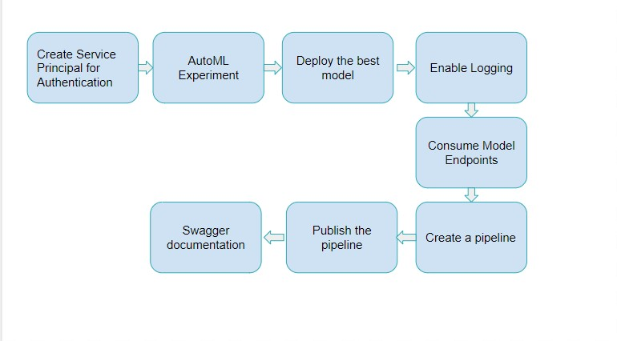

# Operationalizing Machine Learning

In this project Automated ML is used to find the best model. The model is then deployed. The application insigts are enabled in order to obtain importat information.In the later stages, a pipeline is also created and it is published. The dataset used for this project is Bank Marketing dataset. These are the steps that are followed to complete the project.

1.Authentication

2.Automated ML Experiment

3.Deploy the best model

4.Enable logging

5.Swagger Documentation

6.Consume model endpoints

7.Create and publish a pipeline

## Architectural Diagram

## Key Steps

1. Authentication

A service principal should be created for authetication. Since I did the project on the Lab provided with the course, it is done.

2.Auto ML Experiment

The Bank Marketing Dataset needs to be uploaded and a compute cluster  Standard_DS12_V2 is configured with 1 as the minimum umber of nodes. Then an Auto ML experiment is created to find the best model. The follwing screeshots shows the step.

### Dataset

## Screen Recording
*TODO* Provide a link to a screen recording of the project in action. Remember that the screencast should demonstrate:

## Standout Suggestions
*TODO (Optional):* This is where you can provide information about any standout suggestions that you have attempted.
